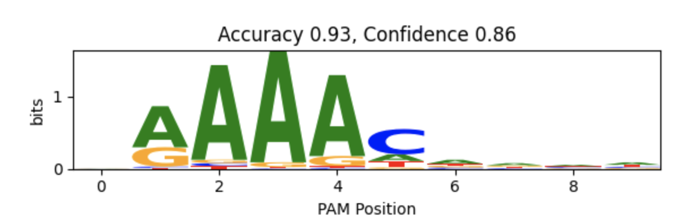

# CRISPR-PAMdb

## Index
- [CICERO: A Machine Learning Model for Cas9 PAM Prediction](#module1)
- [Steps of the Mining Pipeline](#module2)
<br/>

## CICERO: A Machine Learning Model for Cas9 PAM Prediction <a name="module1"></a>

CICERO is a deep learning model built on top of the ESM2 protein language model for predicting PAM sequences directly from Cas9 protein sequences. When applying CICERO to custom Cas9 sequences, users can expect optimal accuracy for sequences more closely related to those in our CRISPR-PAMdb training dataset. In addition, CICERO outputs a confidence score that serves as a useful indicator of prediction reliability. CRISPR-PAMdb is available for download via the supplementary materials of our paper and can currently be accessed from our [preprint](https://doi.org/10.1101/2025.08.13.668647). 


📁 Note: All commands below assume you are working from within the ```cicero/``` directory, which is self-contained.

### 🧪 Setup Environment

To get started with CICERO, set up the Python environment:
```
# Create a new conda environment (Python 3.10 or later)
conda create -n cicero python=3.11 -y

# Activate the environment
conda activate cicero

# Install the required Python packages
pip install -r requirements.txt
```

### 🗂️ CICERO Codebase Structure

```
CICERO/
│
├── __init__.py
├── utils.py
├── train.py
├── train_confidence.py
├── test.py
├── test_Gasiunas.py
│
├── data/
└── out/
    └── ...          # Saved model checkpoints and experiment logs
```

**Note**: You can download the checkpoints for the trained **CICERO-650M** models from this [link](https://drive.switch.ch/index.php/s/xqRkJYbnN4yGhI8).
After downloading, save under the following directory:
```
out/esm2_t33_650M_UR50D-pam_predict-exp0000/
```
Each of the 5 folds should have its own subdirectory within ```esm2_t33_650M_UR50D-pam_predict-exp0000```, e.g.:
```
out/esm2_t33_650M_UR50D-pam_predict-exp0000/run_0/
out/esm2_t33_650M_UR50D-pam_predict-exp0000/run_1/
...
out/esm2_t33_650M_UR50D-pam_predict-exp0000/run_4/
```
Make sure the corresponding checkpoint files directly as obtained from the [link](https://drive.switch.ch/index.php/s/xqRkJYbnN4yGhI8) are inside each ```run_X``` directory.

### 🚀 Training
**Note**: The best-performing and final version of **CICERO** is based on the **650M parameter ESM2 model**. If you want to train CICERO using a smaller baseline model, simply adapt the input argument ```esm_model```. 

To train CICERO-650M on **fold 0** and save it under the experiment name ```exp0000```:

```
python train.py --esm_model "esm2_t33_650M_UR50D" --fold 0 --hidden_dim 1280 --reuse_experiment "exp0000"
```

### ⚙️ Optional: Phase 2 – Confidence Model Training
After training the initial PAM prediction model, you can optionally **train a confidence head** to estimate prediction reliability:
```
python train_confidence.py --esm_model "esm2_t33_650M_UR50D" --fold 0 --exp_dir "exp0000"
```

### 🧪 Testing
Run standard testing on the model trained in ```exp0000``` for fold 0:
```
python test.py --esm_model "esm2_t33_650M_UR50D" --fold 0 --exp_dir "exp0000"
```
If you want to additionally use the confidence model, set the input argument ```use_confidence``` to ```True```. 

### 🌐 External Test: Gasiunas Dataset
Evaluate performance on the external dataset from **Gasiunas et al.**:

```
python test_Gasiunas.py --esm_model "esm2_t33_650M_UR50D" --fold 0 --exp_dir "exp0000"
```
If you want to additionally use the confidence model, set the input argument ```use_confidence``` to ```True```. 
Moreover, you can average the predictions for all folds by removing the ```fold``` input argument using the following command: 
```
python test_Gasiunas.py --esm_model "esm2_t33_650M_UR50D" --exp_dir "exp0000"
```
💡 Expected output for reproducibility: median accuracy of CICERO-650M on the external dataset is 0.7534. 
After running the script, a folder will be created automatically:
```
/predictions/test_Gasiunas/<esm_model>_<exp_dir>/
```
This folder will contain sequence logo plots for each Cas9 prediction. Each plot shows:
- The predicted PAM motif as a sequence logo,
- The accuracy score (and confidence score if enabled).

Example output:



### 🖼 Example Plot
You can also generate a sequence logo plot directly from a PAM prediction array.
An example script is provided in ```cicero/prediction_to_logo.py```, which will produce a figure like the ones created during testing.

### 🔬 Testing Custom FASTA Sequences
You can test CICERO on your own protein sequences using a FASTA file located at ```data/sample_protein.fasta```.
Simply run:
```
python test_sample.py --esm_model "esm2_t33_650M_UR50D" --exp_dir "exp0000"
```
The predicted PAM logos will be saved automatically under:
```
predictions/tmp/<esm_model>-<exp_dir>/
```

### Hardware Requirements

**CICERO-650M** was trained and tested on a single NVIDIA GeForce RTX 4090, running on Ubuntu 20.04.6 LTS.
Evaluation across five test folds took an average of ~212,82 seconds per fold for 1,514 samples (~141 ms/sample).


<br/>

## Steps of the Mining Pipeline <a name="module2"></a>
### Identifying CRISPR Repeats
In the first step we detect CRISPR repeats using [PILER-CR](https://doi.org/10.1186/1471-2105-8-18) and 
[MinCED](https://github.com/ctSkennerton/minced). We then identify the contigs containing the repeats and merge the 
results of the two tools. 

### Identify Cas Proteins and CRISPR Array
On the contigs, we search for protein coding genes using [prodigal](https://doi.org/10.1186/1471-2105-11-119). Using
[hmmsearch](https://doi.org/10.1093/nar/gkr367), we identify Cas proteins among the protein coding genes. The found Cas 
proteins are then checked if they are in flanking regions of the CRISPR repeats.

### Cluster Cas Proteins
To enhance the number of spacers associated with each Cas ortholog, we pooled CRISPR arrays from
closely related Cas proteins. Proteins are clustered using MMseqs2 at 98% amino acid identity.

### Identify PAM and Protospacers
We identified PAM sequences for specific protein clusters by aligning their spacers to protospacers in phage and plasmid genomes. 
We then used the protospacers' flanking regions to derive consensus PAMs.

## How to run the Mining Pipeline
### Cloning the Git Repository

In order to run the pipeline, you need to clone the git repository. This is most easily done by using 
[Git](https://git-scm.com/book/en/v2/Getting-Started-Installing-Git):
```sh
git clone https://github.com/Schwank-Lab/CRISPR-PAMdb.git
```
If you don't want to install or use Git, you can also download the repository on the 
[repository website](https://github.com/Schwank-Lab/CRISPR-PAMdb.git). Click on the button `Code` and then 
`Download Zip`. After the download finished, unzip the folder.

### Setting up the Conda Environment
In order to run the pipeline, you need to have 
[conda](https://docs.conda.io/projects/conda/en/latest/user-guide/install/index.html) installed.
Create the environment using the provided yaml file. Adapt the path to the location of the repository. Please note that the conda environment can only be created on the following platforms: osx64, win32, win64, linux32, linux64, linux-aarch64, linux-s390x and linux-ppc64le, due to limited availability of the package [_libgcc_mutex](https://anaconda.org/anaconda/_libgcc_mutex).
```sh
conda env create -f ~/path/to/CRISPR-PAMdb/snakemake_pipeline/envs/environment.yml
```
Please also download PAMpredict from [their instructions](https://github.com/Matteo-Ciciani/PAMpredict). You don't need to install it, as the necessary library was installed in the previous step.

### Snakemake Pipeline
The snakemake pipeline expects gzipped files as input and is written to use the SLURM queueing system (dont have to use SLURM system though). Set your 
preferences in the [config file](https://github.com/Schwank-Lab/CRISPR-PAMdb/blob/main/snakemake_pipeline/config/config_template.yaml) and add the relative path of the gzipped fasta files from the `input_directory` to the 
[sample file](https://github.com/Schwank-Lab/CRISPR-PAMdb/blob/main/snakemake_pipeline/config/samples). You can then  run the pipeline with:
```sh
conda activate mining
snakemake -s /path/to/CRISPR-PAMdb/snakemake_pipeline/Snakefile --configfile /path/to/CRISPR-PAMdb/snakemake_pipeline/config/config_template.yaml -j 1 --cluster-cancel scancel --use-conda --dryrun
```
Check if the steps listed in the snakemake dry run are what you are planning to run. If this is correct, run:
```sh
snakemake -s /path/to/CRISPR-PAMdb/snakemake_pipeline/Snakefile --configfile /path/to/CRISPR-PAMdb/snakemake_pipeline/config/config_template.yaml -j 1 --cluster-cancel scancel --use-conda
```
We also prepared example configuration files and inputs (can be obtained from the [link](https://drive.switch.ch/index.php/s/xqRkJYbnN4yGhI8)). After you download these inputs, you can run the pipeline with the following command:
```sh
snakemake -s /path/to/CRISPR-PAMdb/snakemake_pipeline/Snakefile --configfile /path/to/CRISPR-PAMdb/snakemake_pipeline/config/toy_config_template.yaml -j 1 --cluster-cancel scancel --use-conda
```
